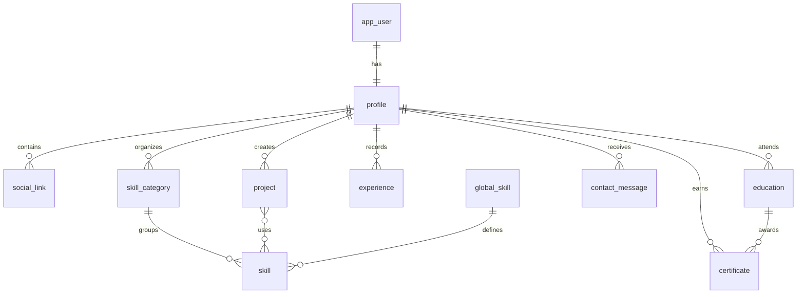

Portfolio Hub API uses MySQL 8.0+ as its primary database with Flyway for automated schema migrations. This guide covers database setup, schema structure, and migration management.

## Database Requirements

<CardGroup cols={2}>
  <Card title="MySQL 8.0+" icon="database">
    Primary database server
  </Card>
  <Card title="Flyway" icon="plane">
    Database migration tool (included)
  </Card>
</CardGroup>

<Note>
  Flyway is automatically included as a Spring Boot dependency. You don't need to install it separately.
</Note>

## Initial Database Setup

### Create Database Schema

Connect to your MySQL server and create the database schema:

```sql
CREATE SCHEMA IF NOT EXISTS `studiostkoh.portafolio`;
```

<Warning>
  The schema name `studiostkoh.portafolio` contains a dot (`.`). Always use backticks when referencing it in SQL queries.
</Warning>

### Create Database User (Optional)

For better security, create a dedicated user for the application:

```sql
-- Create user
CREATE USER 'portfolio_user'@'localhost' IDENTIFIED BY 'secure_password';

-- Grant privileges
GRANT ALL PRIVILEGES ON `studiostkoh.portafolio`.* TO 'portfolio_user'@'localhost';

-- Apply changes
FLUSH PRIVILEGES;
```

<Accordion title="User Permissions Required">
  The database user needs the following permissions:
  - `SELECT`, `INSERT`, `UPDATE`, `DELETE` - Data operations
  - `CREATE`, `ALTER`, `DROP` - Schema migrations (Flyway)
  - `INDEX` - Index management
  - `REFERENCES` - Foreign key constraints
  
  For Flyway to work properly, the user must be able to create and modify tables.
</Accordion>

### Configure Connection

Set environment variables for database connection:

```bash
export MYSQL_HOST=localhost
export MYSQL_PORT=3306
export MYSQL_DATABASE=studiostkoh.portafolio
export MYSQL_USER=portfolio_user
export MYSQL_PASSWORD=secure_password
```

## Flyway Migrations

Portfolio Hub API uses Flyway for version-controlled database migrations. Migrations are automatically executed on application startup.

### Migration Configuration

Flyway is configured in `application.properties`:

```properties
# Enable Flyway
spring.flyway.enabled=true

# Migration scripts location
spring.flyway.locations=classpath:db/migration

# Allow Flyway to work with existing databases
spring.flyway.baseline-on-migrate=true

# Hibernate validation (no auto-modification)
spring.jpa.hibernate.ddl-auto=validate
```

### Migration Files

All migration files are located in `src/main/resources/db/migration/` and follow the naming pattern:

```
V{version}__{description}.sql
```

Current migrations:

1. **V1__init.sql** - Create database schema
2. **V2__create_core_tables.sql** - Create all core tables
3. **V3__add_collaborator_flag.sql** - Add collaborator flag to profiles
4. **V4__create_certificate_table.sql** - Add certificate functionality
5. **V5__migration_and_add.sql** - Add global skills feature

<Note>
  Flyway migrations are immutable. Once applied, they cannot be modified. Always create a new migration for schema changes.
</Note>

## Database Schema

### Schema Overview

The database consists of 11 core tables organized around the central `profile` entity:



### Core Tables

#### 1. app_user - Authentication

Stores user credentials and authentication data:

```sql
CREATE TABLE app_user (
    id BIGINT AUTO_INCREMENT PRIMARY KEY,
    created_at datetime(6) NOT NULL,
    created_by VARCHAR(150),
    updated_at datetime(6),
    updated_by VARCHAR(150),
    version BIGINT,
    email VARCHAR(150) NOT NULL,
    password VARCHAR(255) NOT NULL,
    roles VARCHAR(50) NOT NULL,
    UNIQUE KEY uk_user_email (email)
);
```

**Key Fields:**
- `email` - Unique user identifier for login
- `password` - BCrypt hashed password
- `roles` - User roles (e.g., "ROLE_USER", "ROLE_ADMIN")

#### 2. profile - Portfolio Data

Central table containing user portfolio information:

```sql
CREATE TABLE profile (
    id BIGINT AUTO_INCREMENT PRIMARY KEY,
    created_at datetime(6) NOT NULL,
    created_by VARCHAR(150),
    updated_at datetime(6),
    updated_by VARCHAR(150),
    version BIGINT,
    user_id BIGINT NOT NULL,
    slug VARCHAR(80) NOT NULL,
    full_name VARCHAR(120) NOT NULL,
    headline VARCHAR(160) NOT NULL,
    bio TEXT NOT NULL,
    contact_email VARCHAR(160) NOT NULL,
    location VARCHAR(100),
    avatar_url VARCHAR(512),
    resume_url VARCHAR(512),
    is_tkoh_collaborator BOOLEAN NOT NULL DEFAULT FALSE,
    UNIQUE KEY uk_profile_slug (slug),
    UNIQUE KEY uk_profile_user_id (user_id),
    CONSTRAINT fk_profile_user
        FOREIGN KEY (user_id) REFERENCES app_user(id)
        ON DELETE CASCADE
);
```

**Key Fields:**
- `slug` - URL-friendly unique identifier (e.g., "john-doe")
- `user_id` - One-to-one relationship with app_user
- `avatar_url` / `resume_url` - Google Drive file links
- `is_tkoh_collaborator` - Flag for featured collaborators

#### 3. project - Portfolio Projects

```sql
CREATE TABLE project (
    id BIGINT AUTO_INCREMENT PRIMARY KEY,
    created_at datetime(6) NOT NULL,
    created_by VARCHAR(150),
    updated_at datetime(6),
    updated_by VARCHAR(150),
    version BIGINT,
    profile_id BIGINT NOT NULL,
    title VARCHAR(140) NOT NULL,
    slug VARCHAR(160) NOT NULL,
    summary VARCHAR(280) NOT NULL,
    description TEXT,
    repo_url VARCHAR(512),
    live_url VARCHAR(512),
    cover_image VARCHAR(512),
    start_date DATE,
    end_date DATE,
    featured BOOLEAN NOT NULL DEFAULT FALSE,
    sort_order INT NOT NULL DEFAULT 0,
    UNIQUE KEY uk_project_profile_slug (profile_id, slug),
    INDEX idx_project_featured (profile_id, featured, sort_order),
    CONSTRAINT fk_project_profile
        FOREIGN KEY (profile_id) REFERENCES profile(id)
        ON DELETE CASCADE
);
```

**Key Features:**
- Unique slug per profile (allows duplicate slugs across profiles)
- Featured flag for highlighting important projects
- Sort order for custom ordering
- Composite index on `(profile_id, featured, sort_order)` for performance

#### 4. skill_category & skill - Skills Organization

```sql
CREATE TABLE skill_category (
    id BIGINT AUTO_INCREMENT PRIMARY KEY,
    created_at datetime(6) NOT NULL,
    created_by VARCHAR(150),
    updated_at datetime(6),
    updated_by VARCHAR(150),
    version BIGINT,
    profile_id BIGINT NOT NULL,
    name VARCHAR(80) NOT NULL,
    sort_order INT NOT NULL DEFAULT 0,
    CONSTRAINT fk_skillcategory_profile
        FOREIGN KEY (profile_id) REFERENCES profile(id)
        ON DELETE CASCADE
);

CREATE TABLE skill (
    id BIGINT AUTO_INCREMENT PRIMARY KEY,
    created_at datetime(6) NOT NULL,
    created_by VARCHAR(150),
    updated_at datetime(6),
    updated_by VARCHAR(150),
    version BIGINT,
    category_id BIGINT NOT NULL,
    global_skill_id BIGINT NOT NULL,
    name VARCHAR(80) NULL,
    level SMALLINT,
    icon VARCHAR(255) NULL,
    sort_order INT NOT NULL DEFAULT 0,
    CONSTRAINT fk_skill_category
        FOREIGN KEY (category_id) REFERENCES skill_category(id)
        ON DELETE CASCADE,
    CONSTRAINT fk_skill_global
        FOREIGN KEY (global_skill_id) REFERENCES global_skill(id)
        ON DELETE RESTRICT
);
```

**Skills are organized hierarchically:**
- Categories (e.g., "Frontend", "Backend", "DevOps")
- Skills within categories (e.g., "React", "Spring Boot")
- Skills reference global_skill for standardization

#### 5. global_skill - Global Skill Reference

Added in V5 migration for skill standardization:

```sql
CREATE TABLE global_skill (
    id BIGINT AUTO_INCREMENT PRIMARY KEY,
    created_at datetime(6) NOT NULL,
    created_by VARCHAR(150),
    updated_at datetime(6),
    updated_by VARCHAR(150),
    version BIGINT,
    name VARCHAR(80) NOT NULL,
    icon_url VARCHAR(512),
    UNIQUE KEY uk_global_skill_name (name)
);
```

**Purpose:**
- Centralized skill definitions across all portfolios
- Consistent naming and icons
- Enables skill-based portfolio discovery

#### 6. experience - Work History

```sql
CREATE TABLE experience (
    id BIGINT AUTO_INCREMENT PRIMARY KEY,
    created_at datetime(6) NOT NULL,
    created_by VARCHAR(150),
    updated_at datetime(6),
    updated_by VARCHAR(150),
    version BIGINT,
    profile_id BIGINT NOT NULL,
    company VARCHAR(150) NOT NULL,
    role VARCHAR(150) NOT NULL,
    location VARCHAR(100),
    start_date DATE NOT NULL,
    end_date DATE,
    current BOOLEAN NOT NULL DEFAULT FALSE,
    description TEXT,
    CONSTRAINT fk_experience_profile
        FOREIGN KEY (profile_id) REFERENCES profile(id)
        ON DELETE CASCADE
);
```

**Key Features:**
- `current` flag for ongoing positions
- `end_date` is NULL for current positions

#### 7. education - Academic Background

```sql
CREATE TABLE education (
    id BIGINT AUTO_INCREMENT PRIMARY KEY,
    created_at datetime(6) NOT NULL,
    created_by VARCHAR(150),
    updated_at datetime(6),
    updated_by VARCHAR(150),
    version BIGINT,
    profile_id BIGINT NOT NULL,
    institution VARCHAR(150) NOT NULL,
    degree VARCHAR(150) NOT NULL,
    field VARCHAR(150),
    start_date DATE NOT NULL,
    end_date DATE,
    description TEXT,
    CONSTRAINT fk_education_profile
        FOREIGN KEY (profile_id) REFERENCES profile(id)
        ON DELETE CASCADE
);
```

#### 8. certificate - Certifications

```sql
CREATE TABLE certificate (
    id BIGINT AUTO_INCREMENT PRIMARY KEY,
    created_at datetime(6) NOT NULL,
    created_by VARCHAR(150),
    updated_at datetime(6),
    updated_by VARCHAR(150),
    version BIGINT,
    profile_id BIGINT NOT NULL,
    education_id BIGINT NULL,
    name VARCHAR(255) NOT NULL,
    description TEXT,
    image_url VARCHAR(512),
    file_id VARCHAR(255),
    CONSTRAINT fk_certificate_profile
        FOREIGN KEY (profile_id) REFERENCES profile(id)
        ON DELETE CASCADE,
    CONSTRAINT fk_certificate_education
        FOREIGN KEY (education_id) REFERENCES education(id)
        ON DELETE SET NULL
);
```

**Key Features:**
- Optional link to education record
- Stores Google Drive file ID for certificate documents

#### 9. social_link - Social Media

```sql
CREATE TABLE social_link (
    id BIGINT AUTO_INCREMENT PRIMARY KEY,
    created_at datetime(6) NOT NULL,
    created_by VARCHAR(150),
    updated_at datetime(6),
    updated_by VARCHAR(150),
    version BIGINT,
    profile_id BIGINT NOT NULL,
    platform VARCHAR(50) NOT NULL,
    url VARCHAR(512) NOT NULL,
    sort_order INT NOT NULL DEFAULT 0,
    CONSTRAINT fk_social_profile
        FOREIGN KEY (profile_id) REFERENCES profile(id)
        ON DELETE CASCADE
);
```

#### 10. contact_message - Contact Form Submissions

```sql
CREATE TABLE contact_message (
    id BIGINT AUTO_INCREMENT PRIMARY KEY,
    created_at datetime(6) NOT NULL,
    created_by VARCHAR(150),
    updated_at datetime(6),
    updated_by VARCHAR(150),
    version BIGINT,
    profile_id BIGINT NOT NULL,
    name VARCHAR(120) NOT NULL,
    email VARCHAR(160) NOT NULL,
    message TEXT NOT NULL,
    status VARCHAR(20) NOT NULL DEFAULT 'NEW',
    CONSTRAINT fk_contact_profile
        FOREIGN KEY (profile_id) REFERENCES profile(id)
        ON DELETE CASCADE
);
```

#### 11. project_skill - Many-to-Many Relationship

```sql
CREATE TABLE project_skill (
    project_id BIGINT NOT NULL,
    skill_id BIGINT NOT NULL,
    PRIMARY KEY (project_id, skill_id),
    CONSTRAINT fk_projectskill_project
        FOREIGN KEY (project_id) REFERENCES project(id)
        ON DELETE CASCADE,
    CONSTRAINT fk_projectskill_skill
        FOREIGN KEY (skill_id) REFERENCES skill(id)
        ON DELETE CASCADE
);
```

Links projects to the skills used in them.

### Audit Fields

All tables include standard audit fields:

- `created_at` - Timestamp when record was created
- `created_by` - User who created the record
- `updated_at` - Last update timestamp
- `updated_by` - User who last updated the record
- `version` - Optimistic locking version

## Migration Management

### Automatic Migrations

Migrations run automatically on application startup:

```bash
./mvnw spring-boot:run
```

You'll see Flyway output in the logs:

```
Flyway: Migrating schema `studiostkoh.portafolio` to version 1 - init
Flyway: Migrating schema `studiostkoh.portafolio` to version 2 - create core tables
Flyway: Migrating schema `studiostkoh.portafolio` to version 3 - add collaborator flag
Flyway: Migrating schema `studiostkoh.portafolio` to version 4 - create certificate table
Flyway: Migrating schema `studiostkoh.portafolio` to version 5 - migration and add
Flyway: Successfully applied 5 migrations
```

### Checking Migration Status

View applied migrations:

```sql
SELECT * FROM `studiostkoh.portafolio`.flyway_schema_history
ORDER BY installed_rank;
```

### Creating New Migrations

When you need to modify the schema:

<Steps>
  <Step title="Create Migration File">
    Create a new file in `src/main/resources/db/migration/`:
    
    ```
    V6__add_new_feature.sql
    ```
    
    Follow the naming convention: `V{number}__{description}.sql`
  </Step>
  
  <Step title="Write SQL Changes">
    ```sql
    USE `studiostkoh.portafolio`;
    
    -- Add your schema changes
    ALTER TABLE profile ADD COLUMN new_field VARCHAR(100);
    ```
  </Step>
  
  <Step title="Test Migration">
    Restart the application to apply:
    
    ```bash
    ./mvnw spring-boot:run
    ```
  </Step>
</Steps>

<Warning>
  Never modify existing migration files after they've been applied. Always create a new migration for schema changes.
</Warning>

## Database Maintenance

### Backup Database

```bash
mysqldump -u portfolio_user -p "studiostkoh.portafolio" > backup.sql
```

### Restore Database

```bash
mysql -u portfolio_user -p "studiostkoh.portafolio" < backup.sql
```

### Reset Database (Development Only)

<Warning>
  This will delete all data. Only use in development!
</Warning>

```sql
DROP SCHEMA `studiostkoh.portafolio`;
CREATE SCHEMA `studiostkoh.portafolio`;
```

Then restart the application to rerun all migrations.

## Performance Optimization

### Indexes

The schema includes strategic indexes:

- **Unique indexes** on email, slug, and (profile_id, slug) combinations
- **Composite index** on `(profile_id, featured, sort_order)` for efficient project queries
- **Foreign key indexes** automatically created by MySQL

### Connection Pooling

Portfolio Hub API uses HikariCP (default in Spring Boot):

```properties
spring.datasource.hikari.maximum-pool-size=10
spring.datasource.hikari.minimum-idle=5
spring.datasource.hikari.connection-timeout=30000
```

## Troubleshooting

<AccordionGroup>
  <Accordion title="Flyway migration failed">
    **Symptoms:** Application fails to start with Flyway error
    
    **Solutions:**
    1. Check database user has CREATE/ALTER permissions
    2. Verify schema exists: `SHOW DATABASES LIKE 'studiostkoh.portafolio';`
    3. Check migration file syntax
    4. Review `flyway_schema_history` table for failed migrations
    
    **Repair failed migration:**
    ```sql
    DELETE FROM `studiostkoh.portafolio`.flyway_schema_history 
    WHERE success = 0;
    ```
  </Accordion>

  <Accordion title="Schema validation failed">
    **Symptoms:** `Hibernate validation error` on startup
    
    **Cause:** Schema doesn't match JPA entities
    
    **Solution:**
    1. Ensure all Flyway migrations have run successfully
    2. Check for manual schema modifications
    3. Compare schema with entity definitions
  </Accordion>

  <Accordion title="Connection refused">
    **Symptoms:** Cannot connect to MySQL
    
    **Check:**
    ```bash
    # Is MySQL running?
    sudo systemctl status mysql
    
    # Can you connect manually?
    mysql -h localhost -u portfolio_user -p
    
    # Check environment variables
    echo $MYSQL_HOST
    echo $MYSQL_USER
    ```
  </Accordion>

  <Accordion title="Duplicate entry errors">
    **Symptoms:** Unique constraint violations
    
    **Check unique constraints:**
    - Email must be unique in `app_user`
    - Slug must be unique in `profile`
    - (profile_id, slug) must be unique in `project`
    - Global skill name must be unique
  </Accordion>
</AccordionGroup>

## Next Steps

<CardGroup cols={2}>
  <Card title="API Reference" icon="code" href="/api/overview">
    Explore database operations via REST API
  </Card>
  <Card title="Authentication" icon="lock" href="/api/authentication">
    Create users and authenticate
  </Card>
  <Card title="Managing Portfolio" icon="briefcase" href="/guides/managing-portfolio">
    Learn about portfolio data management
  </Card>
  <Card title="Configuration" icon="gear" href="/setup/configuration">
    Configure database connection settings
  </Card>
</CardGroup>
